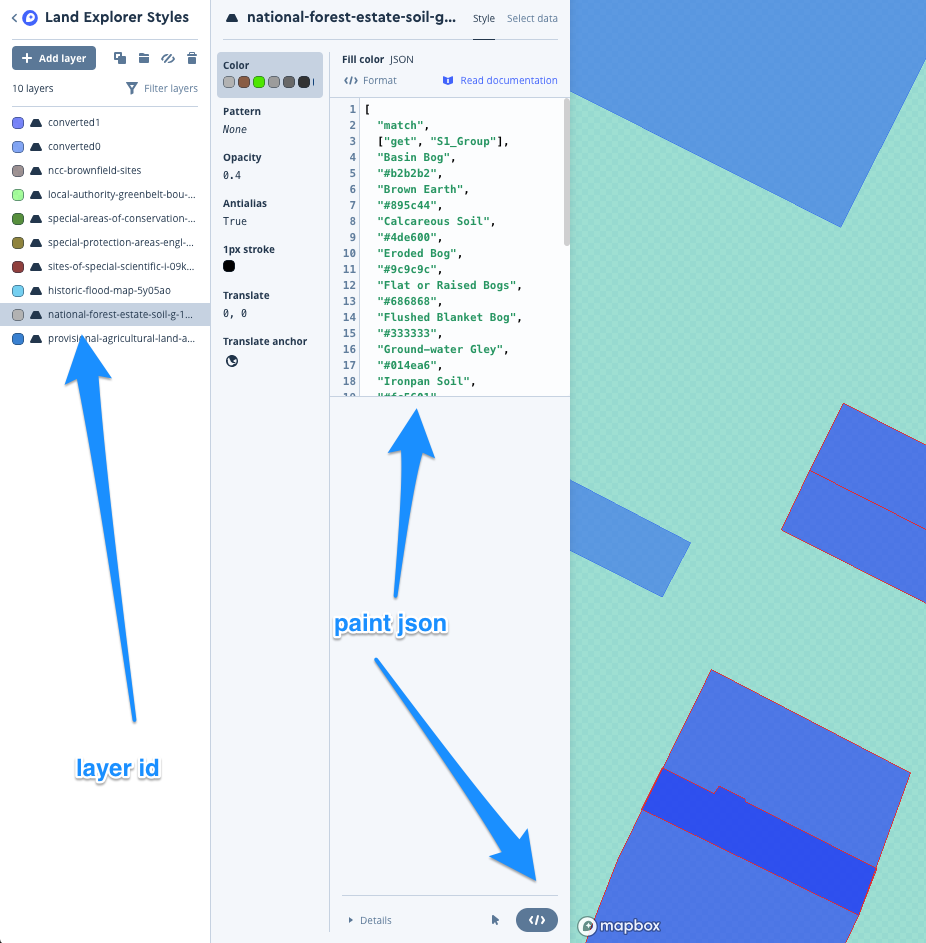

# Land Explorer Documentation (Front End)

## Get Started

1. Clone this repo
2. 'yarn install'
3. create a .env file in the config folder, copying and replacing the values in the .env.example
4. 'yarn start'

### Libraries
>**mapbox-gl** 
    - mapbox
    - https://docs.mapbox.com/mapbox-gl-js/api/
    
>**react-mapbox-gl** 
    react bindings for mapbox (so we can can use state/props to re-render the map)
    - https://github.com/alex3165/react-mapbox-gl/blob/master/docs/API.md
    
>**@mapbox/mapbox-gl-draw** 
    - mapbox drawing tools
    - https://github.com/mapbox/mapbox-gl-draw/blob/master/docs/API.md
    
>**react-mapbox-gl-draw** 
    - react bindings for mapbox drawing tools
    - https://github.com/amaurymartiny/react-mapbox-gl-draw
    
>**@mapbox/mapbox-gl-draw-static-mode**
    - mapbox-gl-draw extension we use this so we can disable interactivity
    - https://github.com/mapbox/mapbox-gl-draw-static-mode
    
>**@mapbox/mapbox-gl-geocoder**
    - we use this to create our custom geocoder (location search) - its used inside the mapbox map, and is injected into TopBar
    - https://github.com/mapbox/mapbox-gl-geocoder/blob/master/API.md
    
> **@turf/turf**
    - We use turf to measure GeoJson polygons/lines and convert them
    - http://turfjs.org/
    
> **convert-units**
    - to convert units (km hectares etc) in PolygonSections
    
>**react-device-detect**
    - to detect if mobile, (to disable drawing tools)
    
>**react-motion**
    - to animate the Draggable component
    
>**react-select**
    - Dropdown menus
    
>**react-spinkit**
    - Loading animations

<br/>

## Mapbox 

#### Adding a new layer to the map

1) Create a new tileset in Mapbox Studio from .geojson, .shp or .mbtiles data
2) Create a new style layer in "Land Explorer Styles" using the new tileset as data source.
3) Get map id - (click on tileset menu -> map ID (looks like "joolzt.4i2tzpgj"))
4) Append map id to data/mapSources.js composite url
5) Append map id to MapLayers.js Source component (tileJsonSource url).
5) Add new Layer component to MapLayers.js
    * id is the style layer id (from Land Explorer Styles in mapbox studio, e.g. local-authority-greenbelt-bou-9r44t6)
    * sourceId is composite (as we appended it to the composite source url in the last step)
    * sourceLayer is the name of the source tileset (e.g Local_Authority_Greenbelt_bou-9r44t6)
    * paint is taken from the json of the style layer (</> icon in the menu)
    
    
    * fillOpacity is used to toggle the layers when active
        ```"fill-opacity": activeLayers.indexOf('historic-flood-map-5y05ao') !== -1 ? .4 : 0,```
6) Add new LandDataLayerToggle component to LeftPaneLandData.js, layerId is the style layer id (e.g. e.g. local-authority-greenbelt-bou-9r44t6)
7) Add layer to MenuKey.js, the key is the style layer id, the data is the layer style json but in object form.

<br/>

#### Drawing Tools

mapbox-gl-draw

https://github.com/mapbox/mapbox-gl-draw/blob/master/docs/API.md


<br/>

## Ordance Survey
#### Creating an ordnance survey key

https://developer.ordnancesurvey.co.uk/
1) Create a new account
2) Complete profile
3) Accept terms and conditions
4) Choose a free trial plan for OS Maps for Enterprise api
5) Choose a free trial plan for OS Places api
6) Add one new key for OS Maps API Enterprise
7) Add one new key containing all 3 OS Places APIs
8) On next screen, click on the keys you just created to get the keys
9) Put keys in constants.js

Last used account was:

    username : chris+new@wearespork.net
    password: dottedcrotchet
<br/>

## OS Places API

#### Postcode Search

https://apidocs.os.uk/docs/os-places-postcode

Search by postcode to get a list of all the properties in it (including their UPRNs)
    
    https://api.ordnancesurvey.co.uk/places/v1/addresses/postcode?postcode=E28NG&key=3ndXJQYYTG6RtUzW2iVkatwhrdG9hf48
        
<br/>

#### UPRN Search - Unique Property Reference Number

https://apidocs.os.uk/docs/os-places-postcode

Search by UPRN to get full address and postcode

    https://api.ordnancesurvey.co.uk/places/v1/addresses/uprn?uprn=10090479306&key=3ndXJQYYTG6RtUzW2iVkatwhrdG9hf48
      
<br/>

## National Polygon Service

#### Shape files
The polygons were provided as a zip file (NSD_FULL_NOV.zip).
Containing shape files (.shp - the actual polygon data) and a URPN .csv for converting UPRN's to TITLE_NO's
and a TENURE .csv for converting the TITLE_NO to estate codes.


#### ogr2ogr

https://www.gdal.org/ogr2ogr.html

ogr2ogr is a command line tool for converting feature data between file formats
(We use it to convert the land registry polygons (.shp files) to geoJSON so they can be converted to .mbtiles files which can be uploaded to mapbox)

example:

    ogr2ogr -progress -f GeoJSON -t_srs EPSG:4326 converted3.geojson LR_POLY_FULL_NOV_2018_3.shp

#### tippecanoe

tippecanoe is a way of converting geojson to mbtiles (so that they can be uploaded to mapbox)

    tippecanoe -o converted-double.mbtiles -zg --drop-densest-as-needed  converted0.geojson converted1.geojson
> This will combine and convert converted0.geojson and converted1.geojson into converted-double.mbtiles file.
> --drop-densest-as-needed automatically reduces polygon detail and lower zoom levels.

<br/>
